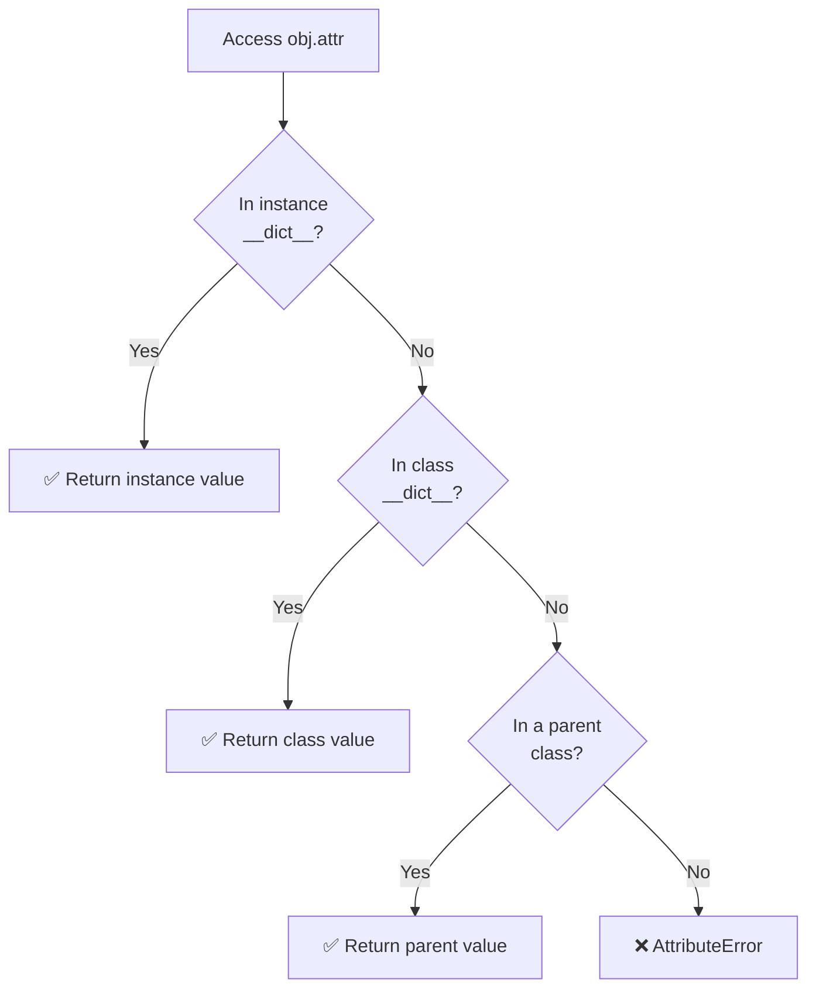
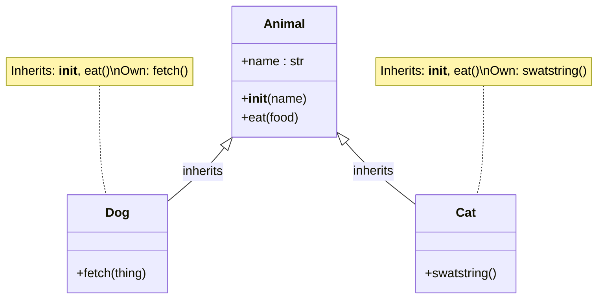
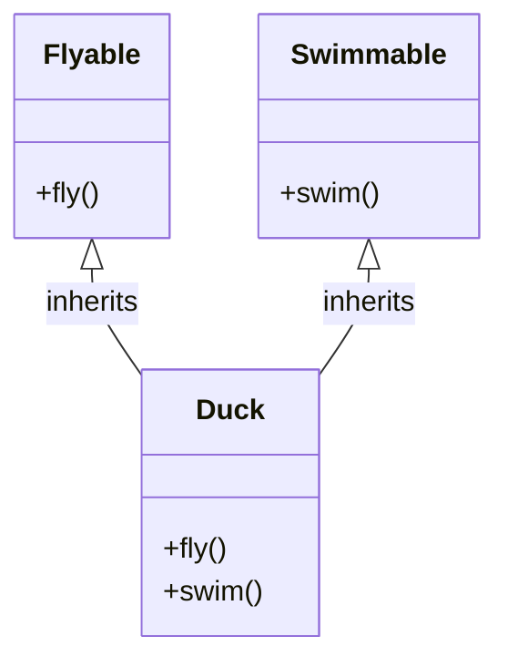
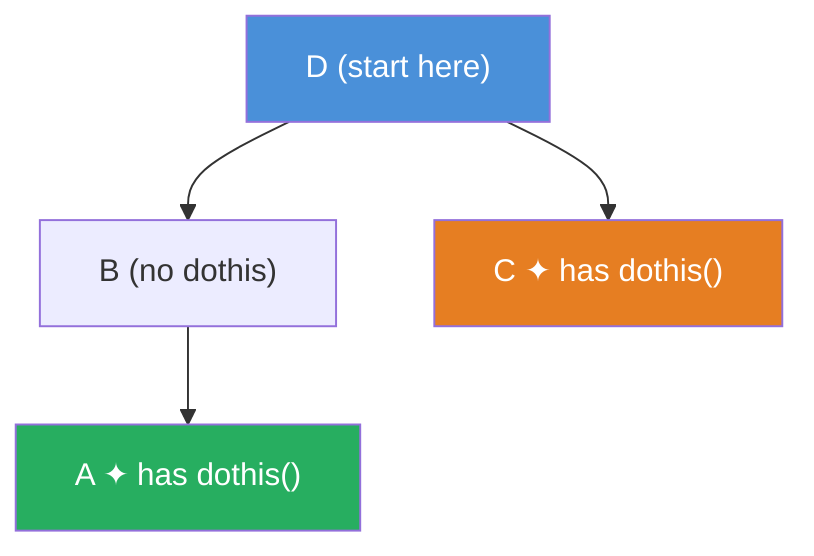
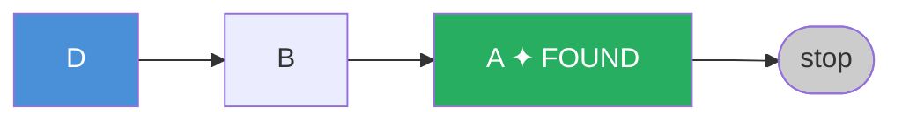
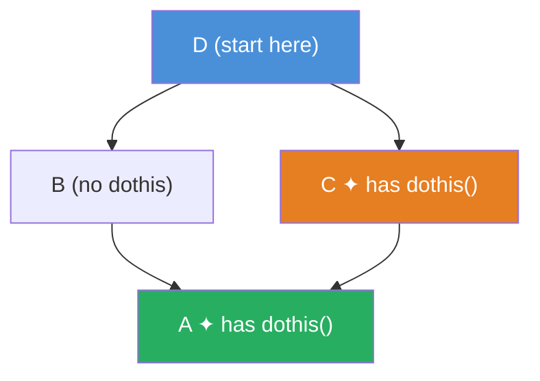
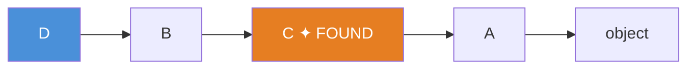
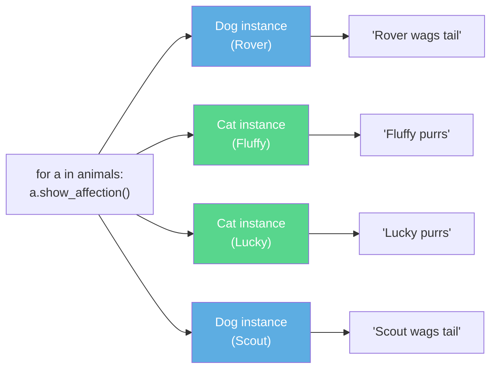
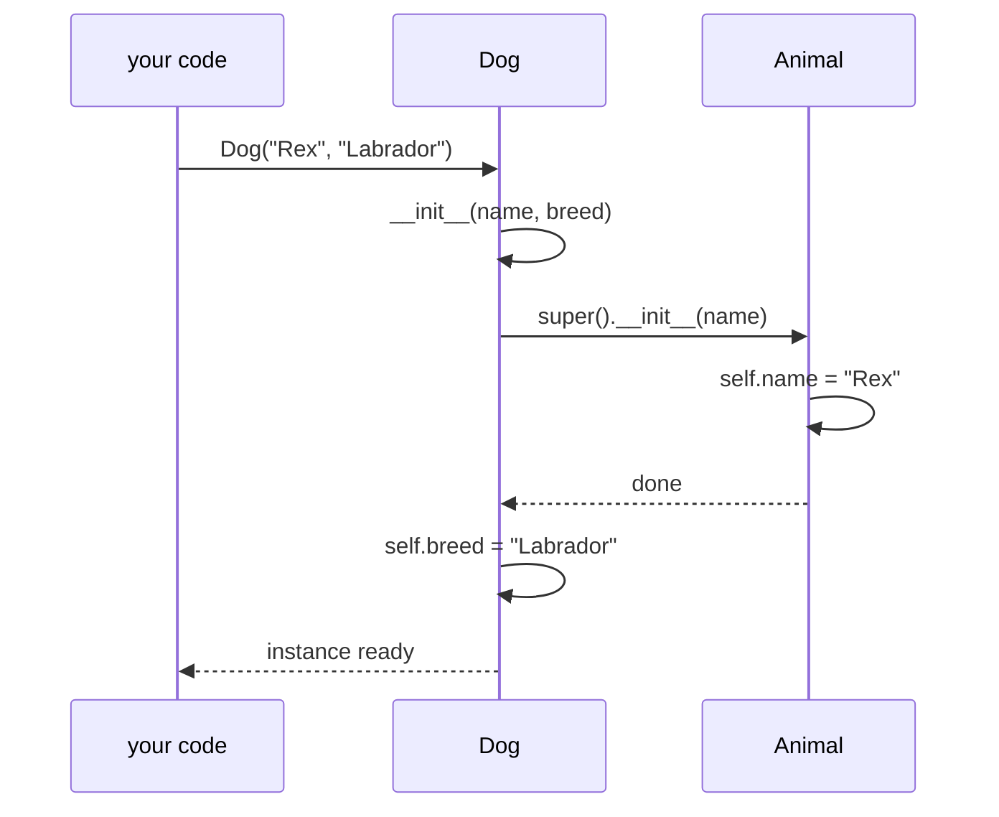
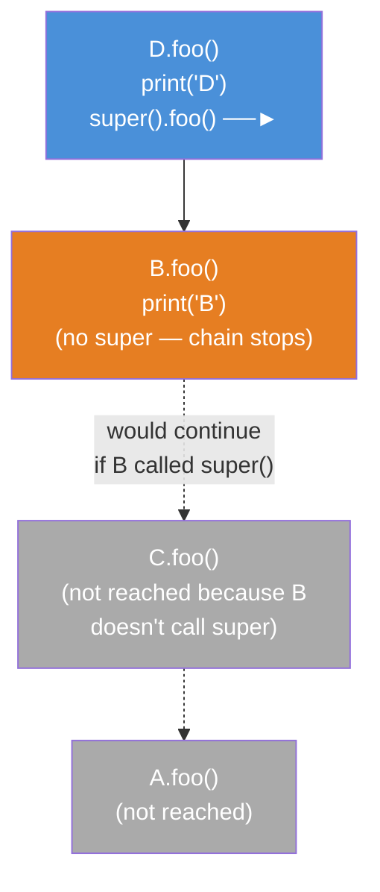

# Object Oriented Programming in Python

A deep-dive study guide covering core OOP concepts in Python, with annotated code examples. Originally written as interview preparation notes; expanded to be a complete reference.

---

## Table of Contents

01. [Classes](#01-classes)
02. [Instances, Instance Methods, Instance Attributes](#02-instances-instance-methods-instance-attributes)
03. [Class Attributes](#03-class-attributes)
04. [The `__init__` Constructor](#04-the-__init__-constructor)
05. [Encapsulation](#05-encapsulation)
06. [Inheritance](#06-inheritance)
07. [Multiple Inheritance and Method/Attribute Lookup](#07-multiple-inheritance-and-methodattribute-lookup)
08. [Method Resolution Order (MRO)](#08-method-resolution-order-mro)
09. [Polymorphism](#09-polymorphism)
10. [Instance Methods (Bound Methods)](#10-instance-methods-bound-methods)
11. [Class Methods](#11-class-methods)
12. [Static Methods](#12-static-methods)
13. [Decorators](#13-decorators)
14. [Magic Methods (Dunder Methods)](#14-magic-methods-dunder-methods)
15. [Abstract Base Classes](#15-abstract-base-classes)
16. [Method Overloading](#16-method-overloading)
17. [super()](#17-super)

---

## 01. Classes

A **class** is the fundamental building block of Object Oriented Programming. Think of it as a blueprint or template that describes the structure and behavior of objects created from it.

- A class defines **attributes** (data) and **methods** (behavior).
- Creating a class doesn't allocate memory for data — it only defines what an object of that class will look like.
- Everything in Python is an object, and every object belongs to some class.

```python
class Dog(object):
    pass
```

`object` is the root of Python's class hierarchy. In Python 3, all classes implicitly inherit from `object`, so `class Dog:` and `class Dog(object):` are equivalent. In Python 2, you must explicitly write `class Dog(object):` to get a **new-style class** (as opposed to old-style classes that don't inherit from `object`).

**Key terminology:**

| Term | Meaning |
| --- | --- |
| Class | The blueprint / template |
| Instance | A concrete object created from a class |
| Attribute | Data stored on a class or instance |
| Method | A function defined inside a class |

**Visualizing a class as a blueprint:**

```text
┌────────────────────────────────────────┐
│  CLASS  Dog          ← the blueprint  │
│  ──────────────────────────────────── │
│  Attributes:  name, breed             │
│  Methods:     bark()                  │
│               fetch(thing)            │
└──────────────┬─────────────────────────┘
               │  Dog("Rover")   Dog("Fido")
               │  instantiate ──────────────────────┐
               ▼                                    ▼
  ┌────────────────────────┐      ┌────────────────────────┐
  │  INSTANCE  rover       │      │  INSTANCE  fido        │
  │  ────────────────────  │      │  ────────────────────  │
  │  name  = "Rover"       │      │  name  = "Fido"        │
  │  breed = "Labrador"    │      │  breed = "Poodle"      │
  └────────────────────────┘      └────────────────────────┘
```

Each instance is independent — `rover.name` and `fido.name` have different values and changing one never affects the other.

---

## 02. Instances, Instance Methods, Instance Attributes

### Instances

An **instance** is a concrete object created from a class using the call syntax `ClassName()`. Each instance is independent — changes to one instance do not affect others.

```python
class Dog(object):
    def bark(self):
        print("Woof!")

rover = Dog()   # rover is an instance of Dog
fido  = Dog()   # fido  is a separate instance of Dog

rover.bark()    # Woof!
fido.bark()     # Woof!
```

### Instance Attributes

**Instance attributes** are data that belong to a specific instance. They are created by assigning to `self.something` inside a method, most commonly inside `__init__`.

```python
class Dog(object):
    def __init__(self, name):
        self.name = name   # instance attribute

rover = Dog("Rover")
fido  = Dog("Fido")

print(rover.name)   # Rover
print(fido.name)    # Fido  — completely independent
```

### Instance Methods

**Instance methods** are ordinary methods that operate on an instance. They always receive `self` as their first argument, which is the handle to the calling instance. Any method you define in a class that takes `self` is an instance method.

```python
class Dog(object):
    def __init__(self, name):
        self.name = name

    def bark(self):
        print(f"{self.name} says Woof!")

rover = Dog("Rover")
rover.bark()   # Rover says Woof!
```

When you write `rover.bark()`, Python automatically passes `rover` as the `self` argument. This is equivalent to `Dog.bark(rover)`.

---

## 03. Class Attributes

**Class attributes** are defined directly on the class body, outside any method. They are shared across all instances of the class.

```python
class YourClass(object):
    classy = 10          # class attribute

    def set_val(self):
        self.insty = 100  # instance attribute (set inside a method)

dd = YourClass()
print(dd.classy)   # 10  — fetched from the class
dd.set_val()
print(dd.insty)    # 100 — fetched from the instance
```

### Attribute Lookup Order

Python's attribute lookup follows this order: **instance → class → parent classes**.



This has an important consequence: if you set an attribute on an instance with the same name as a class attribute, the instance attribute shadows the class one:

```python
class YourClass(object):
    classy = "class value"

dd = YourClass()
print(dd.classy)       # "class value"  — from the class

dd.classy = "Instance value"
print(dd.classy)       # "Instance value" — from the instance (shadows class attr)

del dd.classy          # remove the instance-level shadow
print(dd.classy)       # "class value"  — falls back to the class
```

> Code example: [03-class_attributes/07-class-attributes-2.py](03-class_attributes/07-class-attributes-2.py)

### Class Attributes as Shared State

Class attributes are useful for tracking shared state, such as a count of all instances ever created:

```python
class InstanceCounter(object):
    count = 0   # shared across all instances

    def __init__(self, val):
        self.val = val
        InstanceCounter.count += 1   # update the class attribute directly

a = InstanceCounter(5)
b = InstanceCounter(10)
c = InstanceCounter(15)

print(InstanceCounter.count)   # 3
```

> Code example: [03-class_attributes/08-class-instance-attributes-1.py](03-class_attributes/08-class-instance-attributes-1.py)

**Important:** Mutating a mutable class attribute (like a list) through an instance mutates the shared copy. Reassigning it (`self.attr = new_value`) creates an instance-level copy instead.

---

## 04. The `__init__` Constructor

`__init__` is a **magic method** (also called a dunder method — double underscore) that Python calls automatically when a new instance is created. It is the class constructor.

```python
class MyNum(object):
    def __init__(self):
        print("Instance created!")
        self.val = 0    # set initial state

    def increment(self):
        self.val += 1
        print(self.val)

dd = MyNum()    # prints "Instance created!"
dd.increment()  # 1
dd.increment()  # 2
```

> Code example: [02-init_constructor/04-init_constructor-1.py](02-init_constructor/04-init_constructor-1.py)

### `__init__` with Arguments

`__init__` can accept arguments to configure each instance differently:

```python
class MyNum(object):
    def __init__(self, value):
        try:
            value = int(value)
        except ValueError:
            value = 0
        self.value = value

    def increment(self):
        self.value += 1
        print(self.value)

a = MyNum(10)
a.increment()   # 11
a.increment()   # 12
```

> Code example: [02-init_constructor/05-init_constructor-2.py](02-init_constructor/05-init_constructor-2.py)

### `__init__` is not `__new__`

`__init__` *initializes* an already-created object. The actual memory allocation happens in `__new__`, which runs before `__init__`. In practice you rarely override `__new__` unless implementing singletons or immutable types like subclasses of `int` or `str`.

---

## 05. Encapsulation

**Encapsulation** is the principle of bundling data and the methods that operate on that data within a class, and restricting direct access to internal state. The idea is to interact with an object only through its public interface (methods), not by reaching into its internals.

```text
                  ╔══════════════════════════════════════════╗
                  ║           BankAccount object             ║
                  ║                                          ║
                  ║   ┌──────────────────────────────────┐   ║
                  ║   │    Private / Internal State      │   ║
                  ║   │    __balance = 1000              │   ║
                  ║   └──────────────────────────────────┘   ║
                  ║                                          ║
                  ║   Public Interface  (the only door in)   ║
                  ║   ┌────────────┐  ┌───────────────────┐  ║
                  ║   │ deposit()  │  │  get_balance()    │  ║
                  ║   └─────▲──────┘  └────────▲──────────┘  ║
                  ╚═════════╪═══════════════════╪════════════╝
                            │                   │
                     external code         external code
                     calls deposit()      calls get_balance()

  ✅  acct.deposit(50)          — goes through the interface
  ❌  acct.__balance = 9999     — breaks encapsulation (bypasses validation)
```

### Basic Example

```python
class MyClass(object):
    def set_val(self, val):
        self.value = val

    def get_val(self):
        return self.value

a = MyClass()
a.set_val(10)
print(a.get_val())   # 10
```

> Code example: [01-encapsulation/01-encapsulation-1.py](01-encapsulation/01-encapsulation-1.py)

### Breaking Encapsulation

Python does **not** enforce encapsulation at the language level. You can bypass a setter and write directly to the attribute:

```python
a = MyClass()
a.set_val(10)
a.value = 999    # bypasses set_val() — breaking encapsulation
print(a.get_val())  # 999
```

> Code example: [01-encapsulation/02-encapsulation-2.py](01-encapsulation/02-encapsulation-2.py)

This is **bad practice** because the setter may contain validation logic. If you bypass it, you lose those guarantees:

```python
class MyInteger(object):
    def set_val(self, val):
        try:
            val = int(val)
        except ValueError:
            return
        self.val = val

    def get_val(self):
        print(self.val)

    def increment_val(self):
        self.val += 1

b = MyInteger()
b.val = "MyString"   # breaking encapsulation — now val is a string
b.get_val()          # prints "MyString"
b.increment_val()    # TypeError: can only concatenate str (not "int") to str
```

> Code example: [01-encapsulation/03-encapsulation-3.py](01-encapsulation/03-encapsulation-3.py)

### Name Mangling for Private Attributes

Python uses **name mangling** as a convention for pseudo-private attributes:

- `_name` — single underscore: "internal use" by convention, not enforced. Importing modules with `from module import *` will skip these.
- `__name` — double underscore: Python renames this to `_ClassName__name` internally, making accidental access harder (but not impossible).

```python
class BankAccount(object):
    def __init__(self, balance):
        self.__balance = balance   # name-mangled to _BankAccount__balance

    def deposit(self, amount):
        self.__balance += amount

    def get_balance(self):
        return self.__balance

acct = BankAccount(100)
acct.deposit(50)
print(acct.get_balance())      # 150
# print(acct.__balance)        # AttributeError
print(acct._BankAccount__balance)  # 150 — still accessible, just harder
```

### Properties: The Pythonic Way

The `@property` decorator provides a clean way to add getter/setter logic without changing the external interface:

```python
class Temperature(object):
    def __init__(self, celsius):
        self._celsius = celsius

    @property
    def celsius(self):
        return self._celsius

    @celsius.setter
    def celsius(self, value):
        if value < -273.15:
            raise ValueError("Temperature below absolute zero!")
        self._celsius = value

    @property
    def fahrenheit(self):
        return self._celsius * 9 / 5 + 32

t = Temperature(100)
print(t.celsius)      # 100
print(t.fahrenheit)   # 212.0
t.celsius = 0
print(t.fahrenheit)   # 32.0
```

---

## 06. Inheritance

**Inheritance** allows a class (the **child** or **subclass**) to acquire the attributes and methods of another class (the **parent** or **superclass**). This enables code reuse and the modeling of "is-a" relationships.



```python
class Animal(object):
    def __init__(self, name):
        self.name = name

    def eat(self, food):
        print(f"{self.name} is eating {food}")


class Dog(Animal):          # Dog inherits from Animal
    def fetch(self, thing):
        print(f"{self.name} goes after the {thing}")


class Cat(Animal):          # Cat also inherits from Animal
    def swatstring(self):
        print(f"{self.name} shreds the string!")


d = Dog("Roger")
c = Cat("Fluffy")

d.fetch("paper")    # Dog's own method
d.eat("dog food")   # inherited from Animal

c.eat("cat food")   # inherited from Animal
c.swatstring()      # Cat's own method
```

> Code examples: [04-inheritance/09-inheritance-1.py](04-inheritance/09-inheritance-1.py), [04-inheritance/10-inheritance-2.py](04-inheritance/10-inheritance-2.py)

**Key rules:**

- A child class inherits **all** methods and attributes from the parent.
- Sibling classes (`Dog` and `Cat`) cannot access each other's methods.
- A child can **override** a parent method by defining one with the same name.
- The parent class being inherited from is also called the **base class**.

### Inheriting `__init__`

If a child class does not define its own `__init__`, it inherits the parent's:

```python
class Animal(object):
    def __init__(self, name):
        self.name = name

class Dog(Animal):
    def fetch(self, thing):
        print(f"{self.name} goes after the {thing}")

d = Dog("Roger")   # uses Animal's __init__
print(d.name)      # Roger
d.fetch("frizbee")
```

> Code example: [04-inheritance/13-inheriting-init-constructor-1.py](04-inheritance/13-inheriting-init-constructor-1.py)

If the child defines its own `__init__`, it completely replaces the parent's — unless you explicitly call the parent's `__init__` using `super()` (see [section 17](#17-super)).

### Overriding Methods

A child class can override any parent method:

```python
class Animal(object):
    def speak(self):
        print("...")

class Dog(Animal):
    def speak(self):        # overrides Animal.speak
        print("Woof!")

class Cat(Animal):
    def speak(self):        # overrides Animal.speak
        print("Meow!")

Dog().speak()   # Woof!
Cat().speak()   # Meow!
```

---

## 07. Multiple Inheritance and Method/Attribute Lookup

Python allows a class to inherit from **multiple parent classes** simultaneously.



```python
class Flyable(object):
    def fly(self):
        print("Flying!")

class Swimmable(object):
    def swim(self):
        print("Swimming!")

class Duck(Flyable, Swimmable):
    pass

d = Duck()
d.fly()    # inherited from Flyable
d.swim()   # inherited from Swimmable
```

### Attribute Lookup Chain

When you access `instance.attribute`, Python follows this chain:
1. The instance's own `__dict__`
2. The instance's class
3. Parent classes in **MRO order** (see next section)

> Code examples: [04-inheritance/14-multiple-inheritance-1.py](04-inheritance/14-multiple-inheritance-1.py), [04-inheritance/15-multiple-inheritance-2.py](04-inheritance/15-multiple-inheritance-2.py)

---

## 08. Method Resolution Order (MRO)

**MRO** defines the order in which Python searches classes for a method or attribute. It determines which method wins when multiple classes in the hierarchy define the same name.

### Viewing the MRO

```python
print(ClassName.mro())
# or
print(ClassName.__mro__)
```

### The C3 Linearization Algorithm

Python 3 (and Python 2 new-style classes from 2.3 onwards) uses the **C3 linearization algorithm**, not a naive depth-first search. C3 guarantees:

- The class itself comes first.
- A class always appears before its parents.
- The order in which parents are listed in the class definition is preserved.
- No class appears more than once (duplicates are resolved by keeping the *last* occurrence).

### Simple Inheritance — Depth-First

```text
D inherits from B and C.
B inherits from A.
Both A and C define dothis().

Naive depth-first path: D → B → A → C → A
MRO (with C3):          D → B → A → C → object
```



MRO lookup path for `D().dothis()`:



```python
class A(object):
    def dothis(self): print("doing this in A")

class B(A): pass

class C(object):
    def dothis(self): print("doing this in C")

class D(B, C): pass

d = D()
d.dothis()       # "doing this in A"  — found in A before reaching C
print(D.mro())   # [D, B, A, C, object]
```

> Code example: [04-inheritance/14-multiple-inheritance-1.py](04-inheritance/14-multiple-inheritance-1.py)

### Diamond Inheritance — C3 Removes Duplicates

The **diamond problem** arises when two parents both inherit from the same grandparent. Naive depth-first would visit the grandparent twice.

```text
D inherits from B and C.
B inherits from A.
C inherits from A.
Both A and C define dothis().

Naive path:    D → B → A → C → A   (A appears twice)
C3 MRO:        D → B → C → A       (A's early occurrence removed)
```

The shape of this hierarchy gives it its name — the **diamond problem**:



C3 MRO pushes `A` to the end so each class appears exactly once:



`D().dothis()` resolves to **C**, not A — because C3 delayed A until after C.

```python
class A(object):
    def dothis(self): print("doing this in A")

class B(A): pass

class C(A):
    def dothis(self): print("doing this in C")

class D(B, C): pass

d = D()
d.dothis()       # "doing this in C"  — C comes before A in the MRO
print(D.mro())   # [D, B, C, A, object]
```

Because `A` appears in both `B`'s and `C`'s lineage, C3 pushes `A` to the end — after `C`. So the method is found in `C`, not `A`.

> Code example: [04-inheritance/16-multiple-inheritance-3.py](04-inheritance/16-multiple-inheritance-3.py)

**Interview tip:** When asked "which method gets called?", trace the MRO using `ClassName.mro()`. Never guess.

---

## 09. Polymorphism

**Polymorphism** means "many forms." In OOP, it means different classes can expose the same interface (method name), but each class implements it differently.

The key insight: **same call, different behavior depending on the actual type**.



### Polymorphism through Inheritance

```python
class Animal(object):
    def __init__(self, name):
        self.name = name

class Dog(Animal):
    def show_affection(self):
        print(f"{self.name} wags tail")

class Cat(Animal):
    def show_affection(self):
        print(f"{self.name} purrs")

animals = [Dog("Rover"), Cat("Fluffy"), Cat("Lucky"), Dog("Scout")]
for a in animals:
    a.show_affection()   # each class handles it differently
```

> Code example: [05-polymorphism/11-polymorphism-1.py](05-polymorphism/11-polymorphism-1.py)

### Duck Typing

Python's polymorphism is rooted in **duck typing**: "If it walks like a duck and quacks like a duck, it's a duck." Python doesn't care about the type of an object — it only cares whether the object has the method you're trying to call.

```python
class Duck:
    def speak(self): print("Quack!")

class Person:
    def speak(self): print("I'm speaking!")

for obj in (Duck(), Person()):
    obj.speak()   # works — both have speak()
```

No common base class needed.

### Built-in Polymorphism

Python's built-in functions are themselves polymorphic. `len()` works on strings, lists, dicts, and any object that implements `__len__`:

```python
print(len("Hello"))             # 5
print(len([1, 2, 3]))           # 3
print(len({"a": 1, "b": 2}))   # 2
```

Internally, `len(x)` calls `x.__len__()`. Any class that defines `__len__` participates in this protocol.

> Code example: [05-polymorphism/12-polymorphism-2.py](05-polymorphism/12-polymorphism-2.py)

---

## 10. Instance Methods (Bound Methods)

Instance methods are the default method type in Python. They take `self` as their first parameter, giving them access to the calling instance.

When you access an instance method via `instance.method`, Python returns a **bound method** — the function is bound to the instance, meaning `self` is automatically filled in.

```python
class A(object):
    def method(self):
        return self

a = A()
print(a.method)
# <bound method A.method of <__main__.A object at 0x...>>
```

> Code example: [07-static_class_instance_methods/17-instance_methods-1.py](07-static_class_instance_methods/17-instance_methods-1.py)

Calling `a.method()` is exactly equivalent to calling `A.method(a)`. Python inserts `a` as the first argument automatically — this is the mechanism behind `self`.

```python
class InstanceCounter(object):
    count = 0

    def __init__(self, val):
        self.val = val
        InstanceCounter.count += 1

    def set_val(self, newval):
        self.val = newval

    def get_val(self):
        return self.val

    def get_count(self):
        return InstanceCounter.count

a = InstanceCounter(5)
b = InstanceCounter(10)
c = InstanceCounter(15)

for obj in (a, b, c):
    print(f"Value: {obj.get_val()}, Count: {obj.get_count()}")
```

> Code example: [07-static_class_instance_methods/18-instance_methods-2.py](07-static_class_instance_methods/18-instance_methods-2.py)

---

## 11. Class Methods

A **class method** is decorated with `@classmethod`. Instead of receiving the instance (`self`) as the first argument, it receives the **class itself** (`cls`). This means it operates on the class rather than on a specific instance.

```python
class MyClass(object):
    @classmethod
    def class_method(cls):
        print(f"Called on class: {cls}")

    def instance_method(self):
        print(f"Called on instance: {self}")

MyClass.class_method()     # works — called on the class directly
MyClass().class_method()   # also works — cls is still MyClass
# MyClass.instance_method()  # TypeError — no instance to bind self
MyClass().instance_method() # works
```

> Code example: [07-static_class_instance_methods/27-classmethod-1.py](07-static_class_instance_methods/27-classmethod-1.py)

### Common Use Case: Factory Methods and Class-Level State

```python
class MyClass(object):
    count = 0

    def __init__(self, val):
        self.val = val
        MyClass.count += 1

    def get_val(self):
        return self.val

    @classmethod
    def get_count(cls):
        return cls.count   # cls is MyClass here

obj1 = MyClass(10)
obj2 = MyClass(20)

print(MyClass.get_count())   # 2 — no instance needed
print(obj1.get_count())      # 2 — also accessible via instance
```

> Code example: [07-static_class_instance_methods/28-classmethod-2.py](07-static_class_instance_methods/28-classmethod-2.py)

**Class methods as alternative constructors** is a common pattern:

```python
class Date(object):
    def __init__(self, year, month, day):
        self.year, self.month, self.day = year, month, day

    @classmethod
    def from_string(cls, date_string):
        year, month, day = map(int, date_string.split("-"))
        return cls(year, month, day)   # cls() calls __init__

d = Date.from_string("2024-04-17")
print(d.year, d.month, d.day)   # 2024 4 17
```

### Visual: What Each Method Type Can See

```text
 ┌─────────────────────────────────────────────────────────────────────────┐
 │                          MyClass                                        │
 │                                                                         │
 │  class_attr = 0    ◄──────── shared class-level data                   │
 │                                                                         │
 │  def __init__(self):                                                    │
 │      self.inst_attr = 10   ◄── per-instance data                       │
 │                                                                         │
 │  ┌──────────────────┐  ┌──────────────────┐  ┌──────────────────────┐  │
 │  │  Instance Method │  │  Class Method    │  │  Static Method       │  │
 │  │  def m(self):    │  │  @classmethod    │  │  @staticmethod       │  │
 │  │                  │  │  def m(cls):     │  │  def m():            │  │
 │  │  ✅ inst_attr    │  │  ❌ inst_attr    │  │  ❌ inst_attr        │  │
 │  │  ✅ class_attr   │  │  ✅ class_attr   │  │  ⚠️  class_attr      │  │
 │  │     via self     │  │     via cls      │  │     only via         │  │
 │  │                  │  │                  │  │     MyClass.attr     │  │
 │  └──────────────────┘  └──────────────────┘  └──────────────────────┘  │
 │  Called via instance    Via class OR instance  Via class OR instance    │
 └─────────────────────────────────────────────────────────────────────────┘
```

### Comparison: instance method vs class method vs static method

| | Instance Method | Class Method | Static Method |
| --- | --- | --- | --- |
| First arg | `self` (instance) | `cls` (class) | none |
| Access instance state? | yes | no | no |
| Access class state? | yes (via `self.__class__`) | yes (via `cls`) | only explicitly |
| Called on class directly? | no | yes | yes |
| Decorator | none | `@classmethod` | `@staticmethod` |

---

## 12. Static Methods

A **static method** is decorated with `@staticmethod`. It receives neither `self` nor `cls`. It is essentially a regular function that lives inside a class for organizational purposes.

Use a static method when the function is logically related to the class but does not need to access or modify class or instance state.

```python
class MyClass(object):
    count = 0

    def __init__(self, val):
        self.val = self.filterint(val)   # calling static method from __init__
        MyClass.count += 1

    @staticmethod
    def filterint(value):
        if not isinstance(value, int):
            print("Value is not an int, defaulting to 0")
            return 0
        return value

a = MyClass(5)
b = MyClass("hello")   # Value is not an int, defaulting to 0
print(a.val)           # 5
print(b.val)           # 0
print(MyClass.filterint(42))   # callable on the class directly
```

> Code example: [07-static_class_instance_methods/29-staticmethod-1.py](07-static_class_instance_methods/29-staticmethod-1.py)

```python
class MyClass(object):
    count = 0

    def __init__(self, name):
        self.name = name
        MyClass.count += 1

    @staticmethod
    def status():
        print(f"Total instances: {MyClass.count}")

MyClass("Alpha")
MyClass("Beta")
MyClass("Gamma")

MyClass.status()   # Total instances: 3
```

> Code example: [07-static_class_instance_methods/30-staticmethod-2.py](07-static_class_instance_methods/30-staticmethod-2.py)

**When to use which:**

- Use **instance method** when the method needs to read or write instance state.
- Use **class method** when the method operates on class-level state or serves as an alternative constructor.
- Use **static method** when the method is a utility that doesn't need access to either.

---

## 13. Decorators

A **decorator** is a function that takes another function (or class) as input, wraps it with additional behavior, and returns the modified function. The `@decorator_name` syntax is syntactic sugar for:

```python
my_function = decorator(my_function)
```

**What a decorator actually does — before and after:**

```text
BEFORE decoration                AFTER  @my_decorator
─────────────────                ────────────────────────────────────────
                                 ┌──────────────────────────────────────┐
                                 │  inner_decorator()   ← what you call │
                                 │  ┌────────────────────────────────┐  │
                                 │  │  print("Before the function")  │  │
┌─────────────────────┐          │  ├────────────────────────────────┤  │
│  my_decorated()     │  ──────► │  │  my_decorated()  ← original   │  │
│                     │          │  │  print("This happened!")       │  │
│  print("This        │          │  ├────────────────────────────────┤  │
│         happened!") │          │  │  print("After the function")   │  │
└─────────────────────┘          │  └────────────────────────────────┘  │
                                 └──────────────────────────────────────┘
```

The original function is **wrapped** — it still runs, but now surrounded by the decorator's extra behavior.

### Anatomy of a Decorator

```python
def my_decorator(my_function):        # (1) receives the function to wrap
    def inner_decorator():            # (2) defines the wrapper
        print("Before the function")  # (3) runs before
        my_function()                 # (4) calls the original
        print("After the function")   # (5) runs after
    return inner_decorator            # (6) returns the wrapper, not the result

@my_decorator
def my_decorated():
    print("This happened!")

my_decorated()
# Before the function
# This happened!
# After the function
```

> Code example: [06-decorators/19-decorators-1.py](06-decorators/19-decorators-1.py)

### Decorators with Timestamps

```python
import datetime

def my_decorator(inner):
    def inner_decorator():
        print(datetime.datetime.utcnow())
        inner()
        print(datetime.datetime.utcnow())
    return inner_decorator

@my_decorator
def decorated():
    print("This happened!")

decorated()
# 2024-04-17 10:00:00.000001
# This happened!
# 2024-04-17 10:00:00.000045
```

> Code example: [06-decorators/20-decorators-2.py](06-decorators/20-decorators-2.py)

### Decorators with Arguments

When the decorated function accepts arguments, the wrapper must accept them too:

```python
import datetime

def my_decorator(inner):
    def inner_decorator(num_copy):        # mirrors decorated()'s signature
        print(datetime.datetime.utcnow())
        inner(int(num_copy) + 1)          # can transform the args
        print(datetime.datetime.utcnow())
    return inner_decorator

@my_decorator
def decorated(number):
    print(f"This happened: {number}")

decorated(5)
# 2024-04-17 10:00:00.000001
# This happened: 6
# 2024-04-17 10:00:00.000038
```

> Code example: [06-decorators/21-decorators-3.py](06-decorators/21-decorators-3.py)

### Universal Decorators with `*args` and `**kwargs`

To write a decorator that works on any function regardless of signature, use `*args` and `**kwargs`:

```python
def decorator(inner):
    def inner_decorator(*args, **kwargs):
        print(f"This function takes {len(args)} positional argument(s)")
        inner(*args, **kwargs)
    return inner_decorator

@decorator
def greet(name):
    print(f"Hello, {name}!")

@decorator
def add(a, b):
    print(f"Sum: {a + b}")

greet("Alice")   # This function takes 1 positional argument(s)  /  Hello, Alice!
add(3, 4)        # This function takes 2 positional argument(s)  /  Sum: 7
```

> Code examples: [06-decorators/22-decorators-4.py](06-decorators/22-decorators-4.py), [06-decorators/24-decorators-6.py](06-decorators/24-decorators-6.py)

### Practical Example: Exception Handling Decorator

```python
def handle_exceptions(func):
    def inner(*args, **kwargs):
        try:
            return func(*args, **kwargs)
        except Exception as e:
            print(f"An exception was thrown: {e}")
    return inner

@handle_exceptions
def divide(x, y):
    return x / y

print(divide(8, 2))    # 4.0
print(divide(8, 0))    # An exception was thrown: division by zero
```

> Code example: [06-decorators/23-decorators-5.py](06-decorators/23-decorators-5.py)

### Practical Example: Output Multiplier

```python
def double(my_func):
    def inner_func(a, b):
        return 2 * my_func(a, b)
    return inner_func

@double
def adder(a, b):
    return a + b

@double
def subtractor(a, b):
    return a - b

print(adder(10, 20))       # 60  (2 * 30)
print(subtractor(6, 1))    # 10  (2 * 5)
```

> Code example: [06-decorators/25-decorators-7.py](06-decorators/25-decorators-7.py)

### Class Decorators

Decorators can be applied to entire classes. A class decorator receives the class as its argument and should return a class:

```python
def honorific(cls):
    class HonorificCls(cls):
        def full_name(self):
            return "Dr. " + super().full_name()
    return HonorificCls

@honorific
class Name(object):
    def __init__(self, first, last):
        self.first = first
        self.last = last

    def full_name(self):
        return f"{self.first} {self.last}"

print(Name("Vimal", "A.R").full_name())   # Dr. Vimal A.R
```

> Code example: [06-decorators/26-class-decorators.py](06-decorators/26-class-decorators.py)

### The `functools.wraps` Best Practice

Wrapping a function loses its `__name__` and `__doc__`. Always use `functools.wraps` in production decorators:

```python
import functools

def my_decorator(func):
    @functools.wraps(func)   # preserves func's metadata
    def wrapper(*args, **kwargs):
        print("Before")
        result = func(*args, **kwargs)
        print("After")
        return result
    return wrapper

@my_decorator
def greet():
    """Says hello."""
    print("Hello!")

print(greet.__name__)   # greet  (not "wrapper")
print(greet.__doc__)    # Says hello.
```

---

## 14. Magic Methods (Dunder Methods)

**Magic methods** (also called **dunder methods**, from *d*ouble *under*score) are special methods that Python calls implicitly to implement operators, built-in functions, and protocols. They are the engine behind Python's data model.

All magic methods follow the pattern `__name__`.

### `__repr__` and `__str__`

- `__repr__`: machine-readable representation, used by `repr()` and in the REPL. Should ideally be a string that recreates the object.
- `__str__`: human-readable representation, used by `print()` and `str()`. Falls back to `__repr__` if not defined.

```python
class PrintList(object):
    def __init__(self, my_list):
        self.mylist = my_list

    def __repr__(self):
        return str(self.mylist)

    def __str__(self):
        return f"PrintList({self.mylist})"

pl = PrintList(["a", "b", "c"])
print(pl)          # PrintList(['a', 'b', 'c'])  — calls __str__
print(repr(pl))    # ['a', 'b', 'c']             — calls __repr__
```

> Code example: [07-static_class_instance_methods/31-magicmethods-1.py](07-static_class_instance_methods/31-magicmethods-1.py)

### Operators as Magic Methods

Every operator in Python maps to a magic method. When you write `a + b`, Python calls `a.__add__(b)`.

```python
my_list_1 = ["a", "b", "c"]
my_list_2 = ["d", "e", "f"]

print(my_list_1 + my_list_2)            # ['a', 'b', 'c', 'd', 'e', 'f']
print(my_list_1.__add__(my_list_2))     # same result — + calls __add__
```

> Code example: [07-static_class_instance_methods/32-magicmethods-2.py](07-static_class_instance_methods/32-magicmethods-2.py)

### Common Magic Methods Reference

| Category | Method | Triggered by |
| --- | --- | --- |
| Representation | `__repr__` | `repr(obj)`, REPL display |
| Representation | `__str__` | `print(obj)`, `str(obj)` |
| Lifecycle | `__init__` | `ClassName(...)` |
| Lifecycle | `__new__` | object allocation (before `__init__`) |
| Lifecycle | `__del__` | garbage collection |
| Arithmetic | `__add__` | `a + b` |
| Arithmetic | `__sub__` | `a - b` |
| Arithmetic | `__mul__` | `a * b` |
| Arithmetic | `__truediv__` | `a / b` |
| Arithmetic | `__floordiv__` | `a // b` |
| Arithmetic | `__mod__` | `a % b` |
| Arithmetic | `__pow__` | `a ** b` |
| Comparison | `__eq__` | `a == b` |
| Comparison | `__ne__` | `a != b` |
| Comparison | `__lt__` | `a < b` |
| Comparison | `__le__` | `a <= b` |
| Comparison | `__gt__` | `a > b` |
| Comparison | `__ge__` | `a >= b` |
| Container | `__len__` | `len(obj)` |
| Container | `__getitem__` | `obj[key]` |
| Container | `__setitem__` | `obj[key] = val` |
| Container | `__delitem__` | `del obj[key]` |
| Container | `__contains__` | `item in obj` |
| Container | `__iter__` | `for x in obj` |
| Container | `__next__` | `next(obj)` |
| Context manager | `__enter__` | `with obj as x:` |
| Context manager | `__exit__` | end of `with` block |
| Callable | `__call__` | `obj(args)` |
| Attribute access | `__getattr__` | `obj.name` (when not found normally) |
| Attribute access | `__setattr__` | `obj.name = val` |

### Custom `__eq__` and `__hash__`

If you define `__eq__`, Python sets `__hash__` to `None` by default (making your object unhashable). Define both together if you need the object to work in sets or as dict keys:

```python
class Point(object):
    def __init__(self, x, y):
        self.x = x
        self.y = y

    def __eq__(self, other):
        return self.x == other.x and self.y == other.y

    def __hash__(self):
        return hash((self.x, self.y))

p1 = Point(1, 2)
p2 = Point(1, 2)
print(p1 == p2)           # True
print({p1, p2})           # {Point} — one item, they're equal
```

---

## 15. Abstract Base Classes

An **Abstract Base Class (ABC)** is a class that defines a contract — a set of methods that every subclass *must* implement. You cannot instantiate an ABC directly; it exists purely as a template.

ABCs are defined using the `abc` module.

### Python 3 Style (Recommended)

```python
import abc

class MyABC(abc.ABC):
    @abc.abstractmethod
    def set_val(self, val):
        pass

    @abc.abstractmethod
    def get_val(self):
        pass
```

### Python 2 Style (Legacy — also works in Python 3)

```python
import abc

class MyABC(object):
    __metaclass__ = abc.ABCMeta   # Python 2 only

    @abc.abstractmethod
    def set_val(self, val):
        return

    @abc.abstractmethod
    def get_val(self):
        return
```

> Code examples: [08-abstract_classes/34-abstractclasses-1.py](08-abstract_classes/34-abstractclasses-1.py), [08-abstract_classes/35-abstractclasses-2.py](08-abstract_classes/35-abstractclasses-2.py)

### Implementing an ABC

A concrete subclass must implement **all** abstract methods, or it will also be abstract (and also uninstantiable):

```python
import abc

class My_ABC_Class(abc.ABC):
    @abc.abstractmethod
    def set_val(self, val):
        pass

    @abc.abstractmethod
    def get_val(self):
        pass


class MyClass(My_ABC_Class):
    def set_val(self, value):
        self.val = value

    def get_val(self):
        return self.val

    def hello(self):
        print("I'm not an abstract method — just a bonus!")


my_obj = MyClass()
my_obj.set_val(10)
print(my_obj.get_val())   # 10
my_obj.hello()
```

### What Happens When You Miss an Abstract Method

```python
class IncompleteClass(My_ABC_Class):
    def set_val(self, val):
        self.val = val
    # get_val not implemented!

obj = IncompleteClass()
# TypeError: Can't instantiate abstract class IncompleteClass
# with abstract method get_val
```

> Code example: [08-abstract_classes/36-abstractclasses-3.py](08-abstract_classes/36-abstractclasses-3.py)

### Why ABCs?

- **Enforce contracts:** guarantee that subclasses provide required behavior.
- **Document intent:** clearly communicate which methods are part of the interface.
- **isinstance checks:** `isinstance(obj, MyABC)` returns `True` for any registered implementor, even without actual inheritance (via `MyABC.register(SomeClass)`).

ABCs are the Pythonic way to define interfaces. Languages like Java have a formal `interface` keyword; Python uses ABCs.

---

## 16. Method Overloading

**Method overloading** in Python means providing a new or extended implementation of a method that was inherited from a parent class. Python does not support overloading based on argument types the way C++ or Java do — instead, you override and extend.

### Extending a Parent Method

A child class can override a parent's method and then call the parent's version using `super()`:

```python
import abc

class MyClass(abc.ABC):
    def my_set_val(self, value):
        self.value = value

    def my_get_val(self):
        return self.value

    @abc.abstractmethod
    def print_doc(self):
        pass


class MyChildClass(MyClass):
    def my_set_val(self, value):
        if not isinstance(value, int):
            value = 0
        super().my_set_val(value)   # extend, not replace

    def print_doc(self):
        print("Documentation for MyChildClass")


obj = MyChildClass()
obj.my_set_val(100)
print(obj.my_get_val())   # 100
obj.print_doc()
```

> Code example: [09-method_overloading/37-method-overloading-1.py](09-method_overloading/37-method-overloading-1.py)

### Overloading to Change Behavior

A child class can completely change how a parent method works. Here `GetSetList` keeps a history of all values set, rather than just the current one:

```python
class GetSetParent(abc.ABC):
    def __init__(self, value):
        self.val = 0

    def set_val(self, value):
        self.val = value

    def get_val(self):
        return self.val

    @abc.abstractmethod
    def showdoc(self):
        pass


class GetSetList(GetSetParent):
    def __init__(self, value=0):
        self.vallist = [value]   # history of all values

    def get_val(self):
        return self.vallist[-1]  # return most recent

    def get_vals(self):
        return self.vallist

    def set_val(self, value):
        self.vallist.append(value)  # append instead of replace

    def showdoc(self):
        print(f"GetSetList, len={len(self.vallist)}, stores value history")
```

> Code example: [09-method_overloading/38-method-overloading-2.py](09-method_overloading/38-method-overloading-2.py)

### Overloading Built-in Methods

You can override built-in container methods by inheriting from built-in types like `list`:

```python
class MyList(list):
    """1-indexed list — index 1 maps to position 0."""

    def __getitem__(self, index):
        if index == 0:
            raise IndexError("MyList is 1-indexed; index 0 is invalid")
        if index > 0:
            index -= 1
        return list.__getitem__(self, index)

    def __setitem__(self, index, value):
        if index == 0:
            raise IndexError
        if index > 0:
            index -= 1
        list.__setitem__(self, index, value)


x = MyList(["a", "b", "c"])
print(x[1])   # "a"  — 1-indexed
print(x[3])   # "c"
```

> Code example: [09-method_overloading/39-method-overloading-3.py](09-method_overloading/39-method-overloading-3.py)

### Python's Approach to Overloading by Argument Type

Python doesn't have method overloading by signature. Instead, use default arguments, `*args`, or type checking inside the method:

```python
class Adder(object):
    def add(self, a, b=None):
        if b is None:
            return a + a   # single arg: double it
        return a + b

obj = Adder()
print(obj.add(5))       # 10
print(obj.add(5, 3))    # 8
```

---

## 17. `super()`

Without `super()`, a child's overridden method completely replaces the parent's. With `super()`, you can call the parent's version and **extend** rather than replace:

```text
Without super()                      With super()
───────────────                      ────────────
ChildClass.func()                    ChildClass.func()
  │                                    │
  └─► "Child class"                    ├─► "Child class"
      (parent never runs)              │
                                       └─► super().func()
                                             │
                                             └─► MyClass.func()
                                                   │
                                                   └─► "Parent class"
```

`super()` returns a proxy object that delegates method calls to a parent class, following the MRO. It is the correct way to call a parent's method from a child, especially in multiple inheritance scenarios.

### Basic Usage

```python
class MyClass(object):
    def func(self):
        print("Called from the Parent class")

class ChildClass(MyClass):
    def func(self):
        print("Called from the Child class")
        super().func()   # delegate to the parent

ChildClass().func()
# Called from the Child class
# Called from the Parent class
```

> Code example: [10-super/40-super-1.py](10-super/40-super-1.py)

### Python 2 vs Python 3 Syntax

```python
# Python 3 — preferred
super().method_name()

# Python 2 — explicit class and self required
super(ClassName, self).method_name()
```

Python 3 introduced the zero-argument form, which is cleaner and avoids repetition.

### `super()` with `__init__`

When a child class has its own `__init__` and needs to also initialize the parent, call `super().__init__()`:

```python
class Animal(object):
    def __init__(self, name):
        self.name = name
        print(f"Animal.__init__ called for {name}")

class Dog(Animal):
    def __init__(self, name, breed):
        super().__init__(name)    # initialize the Animal part
        self.breed = breed
        print(f"Dog.__init__ called, breed={breed}")

d = Dog("Rex", "Labrador")
# Animal.__init__ called for Rex
# Dog.__init__ called, breed=Labrador
print(d.name)    # Rex
print(d.breed)   # Labrador
```

Forgetting to call `super().__init__()` means the parent's initialization code never runs, leaving the parent's attributes unset.

### `super()` with `__init__` — Call Chain Diagram



### `super()` in Multiple Inheritance (Cooperative Inheritance)

In multiple inheritance, `super()` follows the MRO, not just the direct parent. This is called **cooperative multiple inheritance** — each class in the chain calls `super()`, ensuring all classes get initialized:

```python
class A(object):
    def foo(self):
        print("A")

class B(A):
    def foo(self):
        print("B")

class C(A):
    def foo(self):
        print("C")
        super().foo()   # calls A.foo per MRO

class D(B, C):
    def foo(self):
        print("D")
        super().foo()   # calls B.foo per MRO: [D, B, C, A]

d = D()
d.foo()
# D
# B
# (B doesn't call super, so chain stops)
```

> Code example: [10-super/42-super-3.py](10-super/42-super-3.py)

**Key insight:** `super()` doesn't mean "my direct parent" — it means "the next class in the MRO." This is what makes cooperative inheritance work. For it to work correctly, every class in the diamond should call `super()`.



### When to Use `super()`

- Always use `super()` instead of calling the parent class by name directly (`ParentClass.method(self)`). Direct calls break in multiple inheritance scenarios.
- Call `super().__init__()` in child `__init__` methods to ensure the parent is initialized.
- Use `super()` when overloading a method but still wanting the parent's behavior.

---

## Summary: The Four Pillars of OOP

| Pillar | What it means in Python |
| --- | --- |
| **Encapsulation** | Bundle data + methods together; use `_` / `__` naming conventions and `@property` to control access |
| **Inheritance** | A subclass acquires the attributes and methods of its parent; use `super()` to extend, not replace |
| **Polymorphism** | Different classes expose the same interface; Python uses duck typing — no common base required |
| **Abstraction** | Hide complexity behind a clean interface; use ABCs (`abc.ABC`) to enforce contracts on subclasses |

```text
 ┌─────────────────────────────────────────────────────────────────────────────┐
 │                       The Four Pillars of OOP                              │
 │                                                                             │
 │  ┌─────────────────────┐    ┌─────────────────────────────────────────────┐│
 │  │   ENCAPSULATION     │    │                INHERITANCE                  ││
 │  │                     │    │                                             ││
 │  │  ╔═══════════════╗  │    │   Animal ──────────────────────────────┐   ││
 │  │  ║ private state ║  │    │     │  eat()                           │   ││
 │  │  ╚═══════════════╝  │    │     ▼                                  ▼   ││
 │  │  [ public method ]  │    │   Dog              Cat                     ││
 │  │                     │    │   fetch()          swatstring()            ││
 │  │ Hide internals,     │    │                                            ││
 │  │ expose interface    │    │  Child reuses parent's code                ││
 │  └─────────────────────┘    └────────────────────────────────────────────┘│
 │                                                                             │
 │  ┌─────────────────────────────────────────┐  ┌────────────────────────┐  │
 │  │           POLYMORPHISM                  │  │     ABSTRACTION        │  │
 │  │                                         │  │                        │  │
 │  │  animal.speak()  ──► Dog  →  "Woof!"    │  │  class Shape(ABC):     │  │
 │  │                  ──► Cat  →  "Meow!"    │  │    @abstractmethod     │  │
 │  │                  ──► Duck →  "Quack!"   │  │    def area(): ...     │  │
 │  │                                         │  │                        │  │
 │  │  Same call, different behavior          │  │  Enforce a contract;   │  │
 │  │  based on the actual type               │  │  hide the details      │  │
 │  └─────────────────────────────────────────┘  └────────────────────────┘  │
 └─────────────────────────────────────────────────────────────────────────────┘
```

---

## Quick Reference: Python OOP Cheat Sheet

```text
Class definition:       class MyClass(object):
Instance creation:      obj = MyClass()
Instance attribute:     self.x = value        (inside a method)
Class attribute:        x = value             (in class body, outside methods)
Instance method:        def method(self):
Class method:           @classmethod / def method(cls):
Static method:          @staticmethod / def method():
Property getter:        @property / def attr(self):
Property setter:        @attr.setter / def attr(self, value):
Abstract method:        @abc.abstractmethod / def method(self):
Calling parent method:  super().method()
MRO inspection:         ClassName.mro()
Magic method example:   def __repr__(self): return "..."
```
